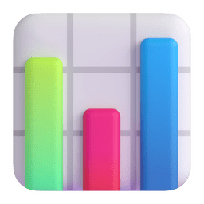
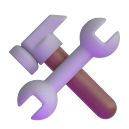
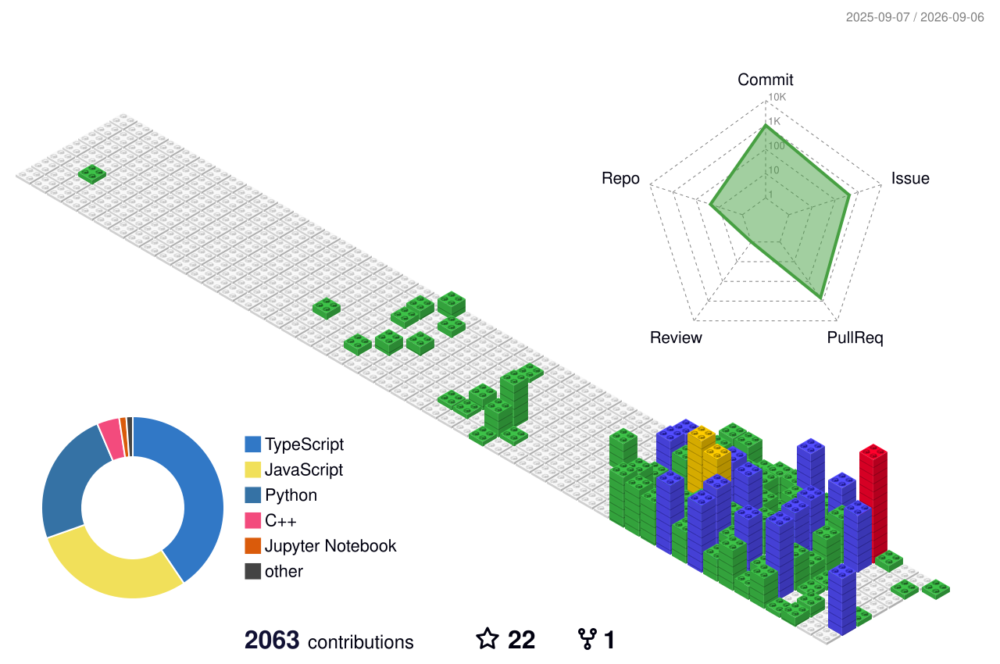

<!--
═══════════════════════════════════════════════════════════════════════════════
  SAKETH SUMAN BATHINI — GITHUB PROFILE README  ·  v2
  Brand: #FF5C00 on #020205  (matches portfolio)
  Username already wired in: SakethSumanBathini
  Only edits needed → the CHECK-THESE list in SETUP.md
═══════════════════════════════════════════════════════════════════════════════
-->

<!-- ══════════════════════ 01 · NAME HEATMAP HERO ══════════════════════ -->

<div align="center">



<br/>

<a href="https://saketh-suman-bathini.vercel.app">

</a>

<br/>


</div>

---

## 👋 whoami

```yaml
name:        Saketh Suman Bathini
role:        Data Analyst  →  AI Engineer
location:    Hyderabad, Telangana, India

education:
  - B.Sc Computer Science  · NxtWave Institute of Advanced Technology  · CGPA 8.69
  - B.Tech CSE             · Sreyas Institute of Engineering & Technology
  - B.Sc Computer Science  · BITS Pilani (Online)

leads:
  - President          · Gen AI Club, NIAT
  - Technical Ops Lead · HackWithIndia
  - Campus Ambassador  · Techniche, IIT Guwahati

builds_with: [Python, SQL, Power BI, Tableau, LangChain, n8n, Groq]
currently:   RAG chatbots · agentic workflows · dashboards people actually open
offline:     national-level table tennis
```

<div align="center">

<pre>
███████╗ █████╗ ██╗  ██╗███████╗████████╗██╗  ██╗
██╔════╝██╔══██╗██║ ██╔╝██╔════╝╚══██╔══╝██║  ██║
███████╗███████║█████╔╝ █████╗     ██║   ███████║
╚════██║██╔══██║██╔═██╗ ██╔══╝     ██║   ██╔══██║
███████║██║  ██║██║  ██╗███████╗   ██║   ██║  ██║
╚══════╝╚═╝  ╚═╝╚═╝  ╚═╝╚══════╝   ╚═╝   ╚═╝  ╚═╝
</pre>

</div>

---

##  &nbsp;About

I turn messy, real-world data into things people make decisions with — dashboards that get opened more than once, and AI agents that quietly do the boring work.

Most of my time goes into two places. **Analytics:** survey design, cleaning, modelling, and the Power BI / Tableau layer on top. **AI engineering:** LangChain pipelines, retrieval-augmented chatbots, and n8n automations that wire the two together.

I learn by shipping under deadline. Three products at a national hackathon in one weekend put me in **India's Top 10**. Eleven weeks of open source ended in **611 merged pull requests across 26 repositories** and a **3rd place** finish. I'd rather have the merge log than the certificate.

Right now I'm going deeper on vector databases, agent orchestration, and getting models into production instead of leaving them in notebooks.

If you're building something with data or AI in it — or hiring for it — I'm at **[sakethsumanbathini@gmail.com](mailto:sakethsumanbathini@gmail.com)**.

---

##  &nbsp;Receipts

<div align="center">


<br/>


<br/>


</div>

| Achievement | Scale | What it was |
|---|---|---|
| **HCL & GUVI National Hackathon** | India Top 10 | Shipped `TriageIQ`, `CallSensei AI`, `SceneSense AI` |
| **ELUSOC 2026** | 3rd place | 611 PRs merged · 26 repos · 11 weeks |
| **India AI Impact Buildathon** | Top 850 / 38,000+ | `Scam Shield` |
| **KultureHire** | +75% engagement | Data Analyst Intern · 100% data accuracy |
| **TTFI National Ranking** | National level | Table tennis |

---

##  &nbsp;ELUSOC 2026 — Full Badge Run

Eleven weeks, 26 repositories, **611 merged pull requests**, and every tier in the ladder cleared — Spawnling through Repo Legend. Finished **3rd overall**.

<div align="center">

<a href="https://www.edulinkup.dev/elusoc/profile/SakethSumanBathini">
  
  
  
  
  <br/>
  
  
  
  
</a>

<br/><br/>

<a href="https://www.edulinkup.dev/elusoc/profile/SakethSumanBathini">

</a>

</div>

<details>
<summary><b>🎖️ The full ladder, in order</b></summary>

<br/>

| Tier | Badge |
|---|---|
| 1 | 🥚 Spawnling |
| 2 | 🪨 Stone Coder |
| 3 | ⛓️ Iron Developer |
| 4 | 🥇 Gold Engineer |
| 5 | 💎 Diamond Architect |
| 6 | 🌌 End Conqueror |
| 7 | 🔥 Netherite Champion |
| 8 | 👑 **Repo Legend** |

All eight tiers cleared. The full contribution log is public on the
[ELUSOC profile](https://www.edulinkup.dev/elusoc/profile/SakethSumanBathini).

</details>

---

##  &nbsp;Arsenal

<div align="center">

<table align="center" border="0" cellpadding="14">
  <tr>
    <td width="190">
      
    </td>
    <td align="left">
      
    </td>
  </tr>
  <tr>
    <td>
      
    </td>
    <td align="left">
      
      
      
      
      
    </td>
  </tr>
  <tr>
    <td>
      
    </td>
    <td align="left">
      
    </td>
  </tr>
  <tr>
    <td>
      
    </td>
    <td align="left">
      
      
      
      
      
    </td>
  </tr>
  <tr>
    <td>
      
    </td>
    <td align="left">
      
    </td>
  </tr>
  <tr>
    <td>
      
    </td>
    <td align="left">
      
    </td>
  </tr>
</table>

</div>

---

## 🌌 Contributions in 3D

<div align="center">



</div>

---

##  &nbsp;The Numbers

<div align="center">


<br/>


<br/><br/>


</div>

<details>
<summary><b>📊 Deep dive — language split, commit times, full metrics</b></summary>

<br/>

<div align="center">

<!-- Generated by GitHub Actions and committed to this repo — these cannot rate-limit. -->



<br/>



<br/><br/>


</div>

</details>

---

## 🐍 Watch It Eat My Commits

<div align="center">

<picture>
  <source media="(prefers-color-scheme: dark)"  srcset="https://raw.githubusercontent.com/SakethSumanBathini/SakethSumanBathini/output/snake-dark.svg" />
  <source media="(prefers-color-scheme: light)" srcset="https://raw.githubusercontent.com/SakethSumanBathini/SakethSumanBathini/output/snake.svg" />
  
</picture>

</div>

---

## 🚀 Featured Work

<table>
<tr>
<td width="50%" valign="top">

#### 🩺 TriageIQ
AI triage assistant that ranks incoming cases by urgency, so the critical ones surface first instead of sitting in a queue.


<sub>🏆 HCL & GUVI National Hackathon — <b>India Top 10</b></sub>

</td>
<td width="50%" valign="top">

#### 📞 CallSensei AI
Turns raw call recordings into structured, searchable insight — transcription, sentiment, and extracted action items.


<sub>🏆 HCL & GUVI National Hackathon — <b>India Top 10</b></sub>

</td>
</tr>
<tr>
<td width="50%" valign="top">

#### 🎬 SceneSense AI
Multimodal scene understanding — feed it video, get back a structured account of what's actually happening in it.


<sub>🏆 HCL & GUVI National Hackathon — <b>India Top 10</b></sub>

</td>
<td width="50%" valign="top">

#### 🛡️ Scam Shield
Flags fraudulent messages and calls before they reach the person being targeted.


<sub>🏅 India AI Impact Buildathon — <b>Top 850 / 38,000+</b></sub>

</td>
</tr>
<tr>
<td width="50%" valign="top">

#### 📊 Gen Z Career Dashboard
A survey on what Gen Z actually wants from work, taken end to end — design, cleaning, modelling, then Power BI and Tableau.


<sub>📈 Full analytics pipeline, solo</sub>

</td>
<td width="50%" valign="top">

#### 🌐 Portfolio
Hand-built, no framework. Orbital constellation, scroll-driven timeline, three-tier RAG chatbot on Groq.


<sub>🎨 Every pixel written by hand</sub>

</td>
</tr>
</table>

---

##  &nbsp;Where I've Shipped

```
2026 ──●  HackWithIndia · Technical Operations Lead
       │  Running technical ops for national-scale hackathons.
       │
       ●  Gen AI Club, NIAT · President
       │  Leading the campus generative-AI community.
       │
2025 ──●  Devnovate · Software Development Intern
       │  Shipping product features in a fast-moving startup stack.
       │
       ●  Cognifyz Technologies · Power BI Data Analytics Intern
       │  Dashboards that moved reporting from weekly to real-time.
       │
2024 ──●  KultureHire · Data Analyst Intern
       │  Analysis behind a 75% engagement lift · 100% data accuracy.
       │
       ●  JPMorgan Chase (Forage) · Excel Skills Virtual Programme
          VBA automation and pivot-driven financial models.
```

<details>
<summary><b>🤝 Community & leadership</b></summary>

<br/>

| Role | Organisation | Period |
|---|---|---|
| **President** | Gen AI Club, NIAT | Current |
| **Technical Operations Lead** | HackWithIndia | Feb 2026 – Present |
| **Insider & Technical Representative** | The Student Spot | Oct 2025 – Present |
| **Campus Ambassador** | Techniche, IIT Guwahati | Aug 2025 – Feb 2026 |
| **Student Partner** | Internshala | — |

</details>

<details>
<summary><b>🎓 Education</b></summary>

<br/>

| Programme | Institution | Notes |
|---|---|---|
| **B.Sc Computer Science** | NxtWave Institute of Advanced Technology (NIAT) | Aug 2025 – Jul 2029 · CGPA **8.69** |
| **B.Tech Computer Science & Engineering** | Sreyas Institute of Engineering & Technology (JNTUH) | Batch 2026 – 2030 |
| **B.Sc Computer Science** | BITS Pilani (Online) | In progress |

</details>

---

##  &nbsp;Right Now

- 🔭 Building **RAG chatbots** on LangChain + Groq, wired into n8n workflows
- 🌱 Going deeper on **vector databases**, agent orchestration, and production ML
- 🎯 Targeting **GSoC 2027** — contributing to open source year-round until then
- 💼 Open to **Data Analyst / AI Engineer** internships
- 🏓 Off-keyboard: national-level table tennis

---

## 🤝 Let's Build Something

<div align="center">

<p>If you're working on something with data or AI in it, my inbox is open.</p>

<a href="mailto:sakethsumanbathini@gmail.com"></a>
<a href="https://linkedin.com/in/YOUR_LINKEDIN"></a>
<a href="https://saketh-suman-bathini.vercel.app"></a>
<a href="https://github.com/SakethSumanBathini"></a>

<br/><br/>

<a href="https://github.com/SakethSumanBathini/SakethSumanBathini/discussions">

</a>

<br/><br/>

<sub>⭐ If something here was useful, a star costs nothing and means a lot.</sub>


</div>
